## Este libro contiene contiene contenido de la instalacion completa de anaconda, paso por paso.

# 1. Instalación de *Anaconda*

#### *1 inicio de la instalación* 

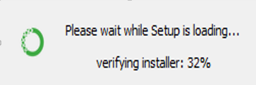

#### *2 Solo seleccionamos en la opción next para continuar la instalación.*

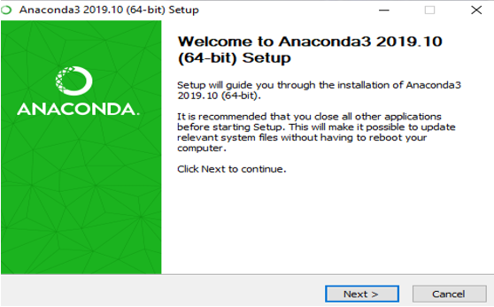

#### *3 Aceptamos los acuerdos de anaconda y continuamos con la instalación.*

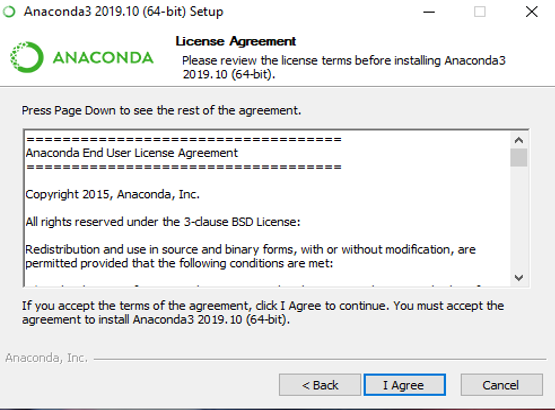

#### *4 En esta opción seleccionamos la primera opción para que la próxima instalación sea recomendad y por el usuario.*

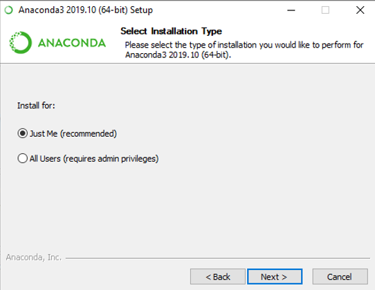

#### *5 Ubicación de la instalación del programa, también podemos seleccionar la ubicación instalación, pero acá la deje por defecto.*
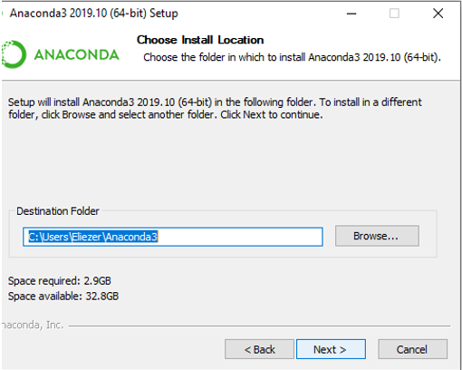

#### *6 En esta fase de instalación deshabilitamos la opción de agregar las variables patch y seleccionamos la segunda opción, donde nos recomienda anaconda que debemos tener instalado Python igual o superior que la versión 3.7 para iniciar la instalación.*

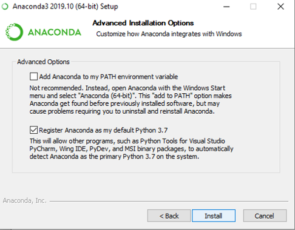

#### *7 Ventana de la finalización de la instalación de anaconda correcta.*

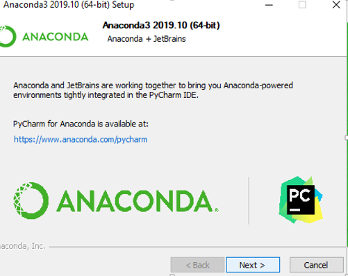

#### *8 Esta parte es ya a la hora de ejecusión del programa yo le desabilite las cajas por que si no las desabilitas entonces te manda a paginas de internet sobre información de anaconda.*

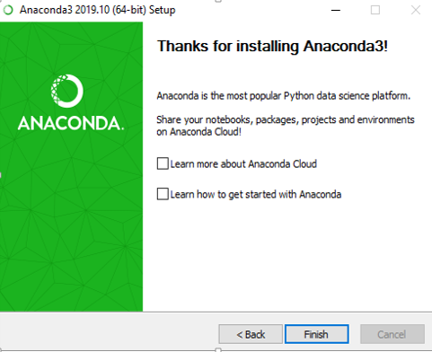

# 2. Pruebas de instalación de jupyter notebook.
## La prueba de instalación correcta de jupyter notebook, se realiza ejecutando, el siguiente comando en el CMD: 
##### **jupyter notebook** 
### Imagen de prueba que se instaló correctamente anaconda y ejecuta sin ningún error.

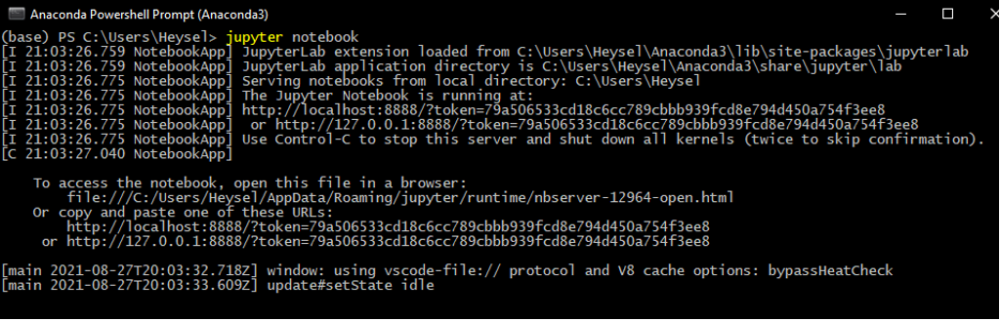

#### Automáticamente, se debe abrir el navegador con la instancia de Jupyter Notebook y los paquetes disponibles a como se puede ver en la captura.

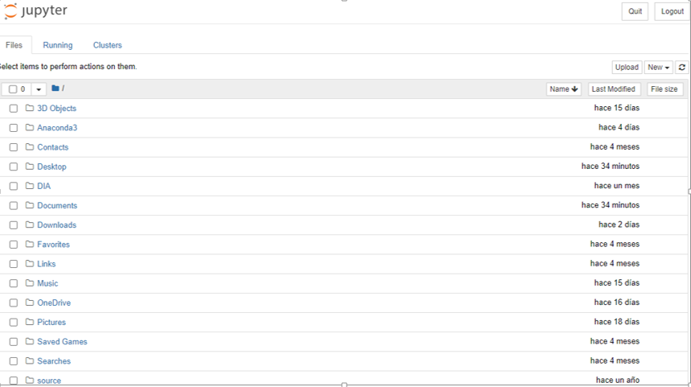

# 2.	Uso de paquetes predeterminados en Jupyter Notebook 

#### Paquetes que se integran con la instalación de jupyter Notebook de Anaconda

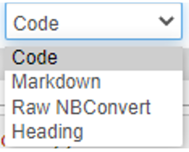

#### Estructura de un cuaderno de jupyter notebook. Estructura de un cuaderno está constituido por una serie de opciones que nos ofrece jupyter.

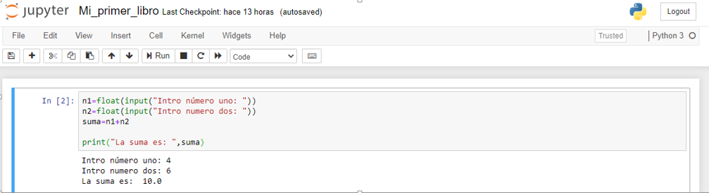

#### -	¿Cómo está dividido un cuaderno de jupyter notebook

##### Un libro de jupyter notebook está dividido por 4 opciones code, markdowns, headins y raw NBConvert las cuales están acompañadas cada una de ellas por la barra de herramienta que se muestra en la parte superior de la imagen.

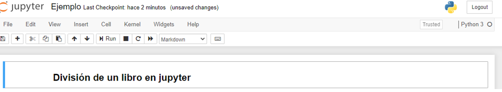  

#### Para la ejecución de un código en jupyter se combinan las teclas CTRL + ENTER, de esta manera ejecutamos un código de Python en jupyter y de markdawn.

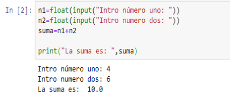

### -	Exportar a formatos estáticos como Markdown, HTML y PDF.

#### Para la exploración de exportación de archivos los cuales están descritos en la descripción, nos vamos a la barra de herramienta de jupyter y seleccionamos File y dentro de file seleccionamos Dowload as y ahí seleccionamos la exportación que deseamos.

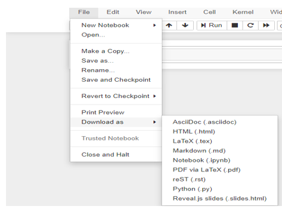

# 3.	Instalación de paquetes adicionales recomendados.

### Conda <NOMBRE_PAQUETE> 
### pip install <NOMBRE_PAQUETE> 

### b.	Instale los siguientes paquetes que se relacionan a la inteligencia artificial.

# -	pip install scikit-learn 
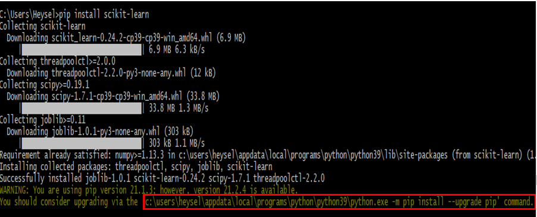

# -	pip install pandas 
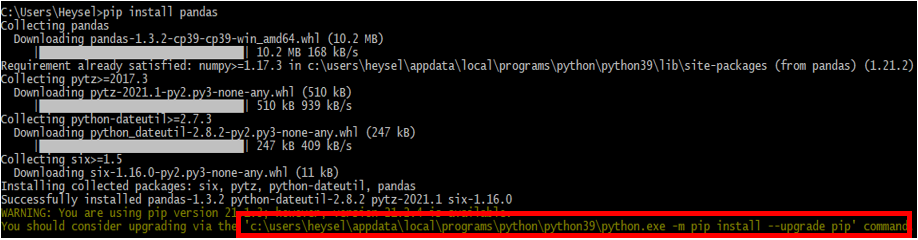

# - pip install numpy
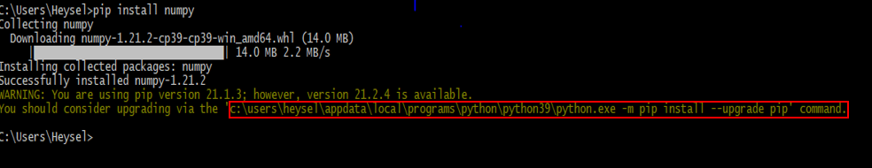

# - pip install tensorflow
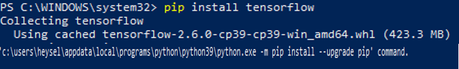

